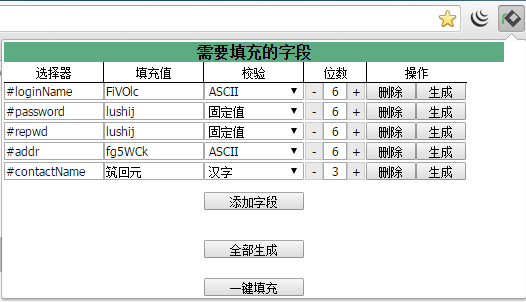

# HelpFill

**HelpFill**是一款chrome浏览器（360极速浏览器）插件，适用场景：需要多次对一个表单填写相同的数据或者每次填写的数据不同的情况。
 

---
##说明：
1. 选择器使用的是jquery的选择器，包含所有jquery支持的选择器
2. 检验(非强校验)目前支持的有ASCII、邮箱、电话号码、汉字（2500个常用汉字）、QQ、固定值、自定义 七种方式
3. 全部生成 不会对固定值和自定义方式的数据进行生成
4. radio默认选中最后一个、checkbox默认全部选择、select默认选择最后一个，可以通过定义选择器对默认值进行覆盖
5. 生成的数据不符合强校验的规则，如果网站表单强校验可能需要修改自动生成的默认数据
6. radio、checkbox、select不符合常用的web写法可能无法正常设置，select如果存在级联可能出错

**HelpFill**只是辅助填充表单，并不完全智能！

